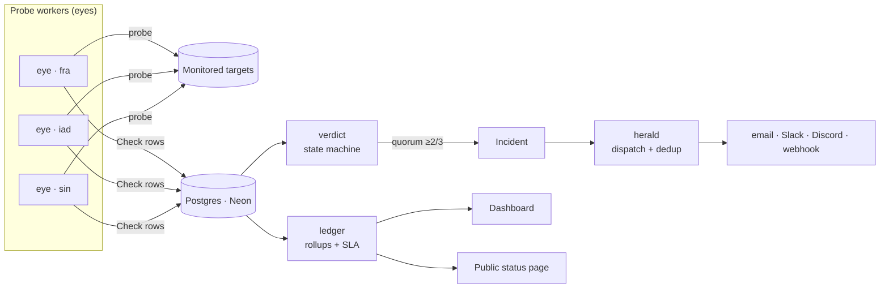

<div align="center">

# Uptick

**Distributed uptime monitoring, incident tracking, and public status pages.**

Probes from multiple regions, decides down by quorum, opens incidents instead of
spamming alerts, and computes SLA from incident durations — not from a naive
pass/fail ratio.

[](https://github.com/Surge77/uptick/actions/workflows/ci.yml)
[](./LICENSE)
[](https://nodejs.org)

</div>

---

## Why this exists

Uptime monitoring looks like a CRUD app with a chart on top. It isn't. The
interesting problems are all invisible in the UI:

| Problem                           | Naive approach                            | What Uptick does                                                                                  |
| --------------------------------- | ----------------------------------------- | ------------------------------------------------------------------------------------------------- |
| A probe fails once                | Open an incident, page someone            | Require **N consecutive** failures — one blip is usually _your_ network, not theirs               |
| A service flaps up/down           | Send 40 alerts                            | Detect flapping, collapse into one incident, suppress the storm                                   |
| Your DB goes down                 | Page for all 9 services that depend on it | Walk the dependency DAG, page **once** for the root cause                                         |
| One region can't reach the target | Declare a global outage                   | Require **quorum** — ≥2 of 3 regions must agree                                                   |
| Compute monthly SLA               | `passed / total` checks                   | Sum **incident durations**; a ratio breaks the moment the check interval changes                  |
| Store every check forever         | Unbounded table, slow queries             | 30-day raw retention + daily rollups; nothing user-facing reads raw checks                        |
| Show a status page                | Serve it from the app                     | Serve it from a **different failure domain** — a status page that dies with your app is worthless |

## Architecture



Named after the metaphor, consistently: **eyes** report, **watch** schedules,
**verdict** decides, **ledger** counts, **herald** announces.

### Repository layout

```
uptick/
├─ apps/
│  ├─ web/          Next.js 16 dashboard + public status page → Vercel
│  └─ worker/       Long-lived Node scheduler, one per region → Railway
├─ packages/
│  ├─ db/           Prisma schema, migrations, seed
│  └─ core/         Pure logic: verdict, ledger, herald, probes
└─ docs/            Architecture, data model, runbook, ADRs
```

`packages/core` is **pure** — no database, no network, no reading the clock (time
is injected). That is deliberate: the genuinely tricky logic can be tested
exhaustively with zero infrastructure.

## Quick start

**Prerequisites:** Node ≥ 22, pnpm ≥ 10, a Postgres database ([Neon](https://neon.tech) free tier works).

```bash
git clone https://github.com/Surge77/uptick.git
cd uptick
pnpm install

cp .env.example .env.local     # then fill in DATABASE_URL and DIRECT_URL
pnpm db:push                   # create the schema
pnpm db:seed                   # 3 regions + a few example monitors

pnpm dev                       # web on :3000, worker in watch mode
```

Run the full quality gate exactly as CI does:

```bash
pnpm gate    # type-check → lint → test → build
```

## Check types

| Type        | What it verifies                                                          |
| ----------- | ------------------------------------------------------------------------- |
| `HTTP`      | Status code, response time, body regex, JSON-path value, response headers |
| `TCP`       | Port reachable within timeout                                             |
| `ICMP`      | Host responds to ping                                                     |
| `SSL`       | Certificate expiry threshold, chain validity                              |
| `DNS`       | A/AAAA/CNAME/MX resolves to an expected value                             |
| `HEARTBEAT` | A cron job pings _us_; alert on silence (dead man's switch)               |

HTTP checks record a full phase breakdown — DNS, TCP connect, TLS handshake,
TTFB — so a slowdown can be attributed rather than just observed.

## Feature status

- [x] **Phase 0** — Monorepo, tooling, CI, docs
- [x] **Phase 1** — Schema + migrations
- [x] **Phase 2** — Verdict state machine + SLA math
- [x] **Phase 3** — Probe executors + SSRF guard
- [x] **Phase 4** — Worker scheduler with leasing
- [x] **Phase 5** — Incidents + rollups
- [ ] **Phase 6** — Alerting with dedup + escalation
- [ ] **Phase 7** — Dashboard + auth
- [ ] **Phase 8** — Public status page
- [ ] **Phase 9** — Quorum · DAG suppression · deploy correlation · error budgets
- [ ] **Phase 10** — Production deploy, rate limiting, v1.0.0

### Deliberately out of scope

On-call rotation scheduling, billing, SSO/SAML, synthetic browser checks, and log
ingestion. Each is a real product need and none of them are the interesting part
of this problem.

## How Uptick compares

Honest positioning — this is a crowded category and Uptick is not trying to
replace any of these.

|                                    | Uptick | Uptime Kuma | Better Stack | Checkly |
| ---------------------------------- | ------ | ----------- | ------------ | ------- |
| Self-hostable                      | ✅     | ✅          | ❌           | ❌      |
| Multi-region quorum                | ✅     | ❌          | ✅           | ✅      |
| Dependency-aware alert suppression | ✅     | ❌          | ❌           | ❌      |
| Deploy correlation on the timeline | ✅     | ❌          | ❌           | partial |
| Error-budget burn-rate alerting    | ✅     | ❌          | ❌           | ❌      |
| On-call rotations                  | ❌     | ❌          | ✅           | partial |
| Browser/synthetic checks           | ❌     | ❌          | ✅           | ✅      |

## Documentation

| Document                                  | Contents                                 |
| ----------------------------------------- | ---------------------------------------- |
| [ARCHITECTURE.md](./docs/ARCHITECTURE.md) | Components, data flow, failure modes     |
| [DATA-MODEL.md](./docs/DATA-MODEL.md)     | Every table, why it exists, how it grows |
| [RUNBOOK.md](./docs/RUNBOOK.md)           | Deploy, roll back, diagnose              |
| [ADRs](./docs/adr/)                       | Why the load-bearing decisions were made |
| [CONTRIBUTING.md](./CONTRIBUTING.md)      | Dev setup, conventions, PR checklist     |
| [SECURITY.md](./SECURITY.md)              | Vulnerability disclosure                 |

## Tech stack

Next.js 16 · React 19 · TypeScript (strict) · Prisma 6 · PostgreSQL (Neon) ·
Auth.js v5 · Vitest · Turborepo · pnpm workspaces · Vercel + Railway

## License

MIT — see [LICENSE](./LICENSE).
